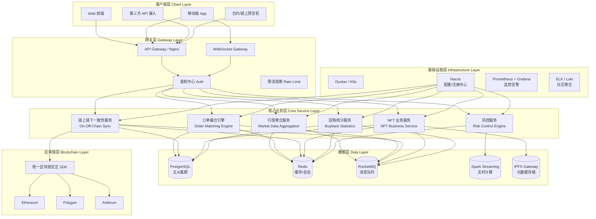
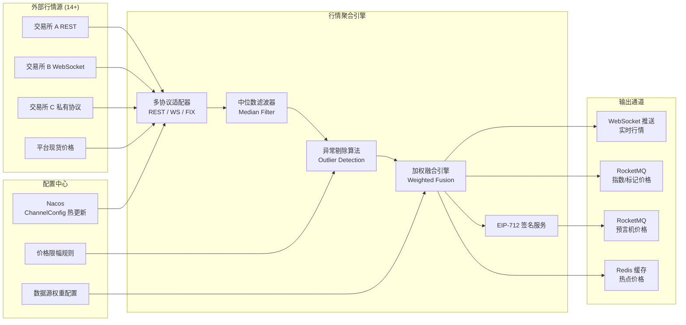
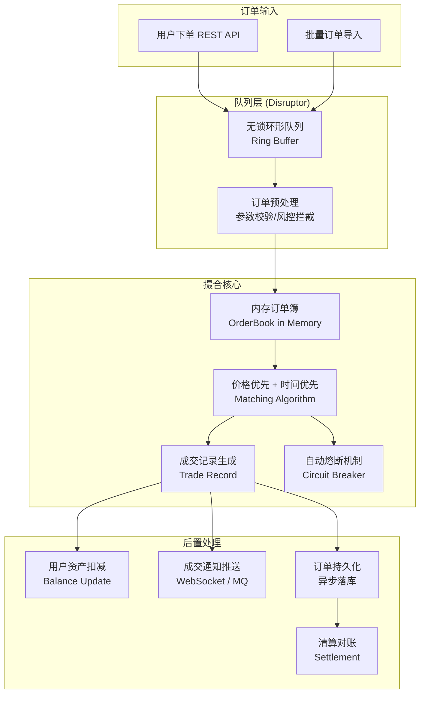
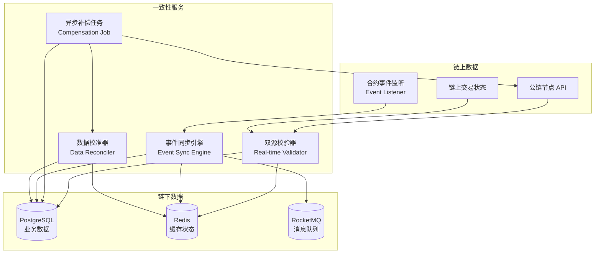
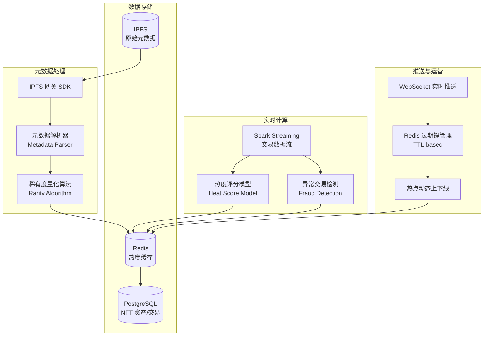
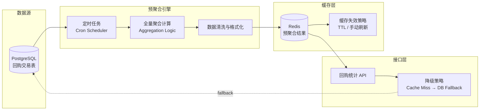
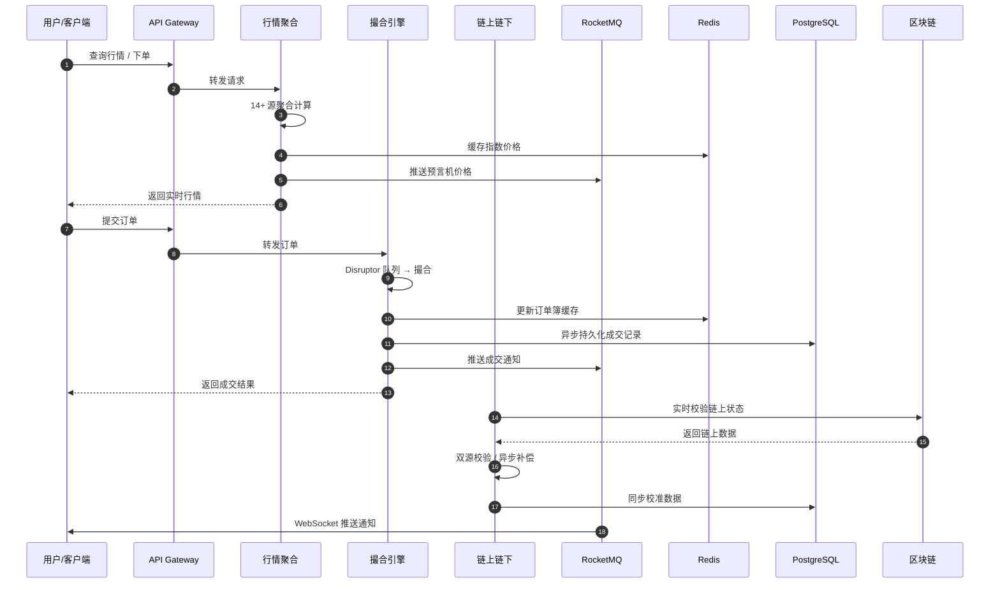
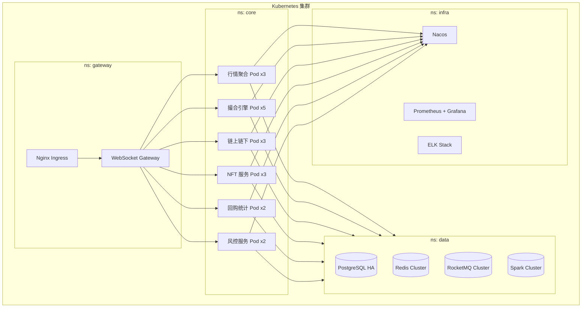

# 加密货币/NFT 综合交易平台 — 系统架构设计文档

> 版本：v1.0  
> 日期：2026-05-09  
> 作者：系统架构组

---

## 1. 项目概述

本项目为面向现货、合约、NFT 交易的综合性数字资产金融平台。核心诉求包括：

- **高并发低延迟**：Disruptor 无锁队列 + 内存订单簿，支撑百万级订单吞吐，撮合延迟 10 ms。
- **抗干扰行情聚合**：14 路异构行情源通过中位数滤波 + 异常剔除算法融合，指数价格精准贴合现货波动。
- **链上链下强一致**：双源校验 + 异步补偿 + 事件监听三重保障，数据一致性达 100%。
- **轻量多链扩展**：统一区块链交互 SDK + 策略模式适配，新增公链仅需 2 周。
- **实时风控与运营**：Spark Streaming 实时交易风控模型 + WebSocket 热点推送，自动识别异常交易并动态管理热点生命周期。

---

## 2. 整体架构分层总览

---

## 3. 子系统详细架构

### 3.1 行情聚合服务

**关键组件说明：**

| 组件 | 技术选型 | 职责 |
|------|---------|------|
| 多协议适配器 | Go + net/http + gorilla/websocket | 适配 REST / WebSocket / FIX 等异构协议 |
| 中位数滤波器 | 自定义算法 | 对 14+ 源价格排序取中位数，降低异常干扰 |
| 异常剔除算法 | Z-Score / IQR | 检测并剔除偏离正常区间的异常价格 |
| 加权融合引擎 | 自定义权重模型 | 结合平台现货权重与交易所权重计算指数价格 |
| EIP-712 签名服务 | go-ethereum/crypto | 对预言机价格进行链上可信签名 |

---

### 3.2 订单撮合引擎

**关键组件说明：**

| 组件 | 技术选型 | 职责 |
|------|---------|------|
| Disruptor 无锁环形队列 | Go 版 Disruptor 实现 | 高并发订单接收，避免锁竞争 |
| 内存订单簿 | Go map + 红黑树 | 按价格和时间排序的买卖盘 |
| 撮合算法 | 自定义匹配引擎 | 价格优先、时间优先的撮合逻辑 |
| 自动熔断 | Sentinel / 自研 | 极端行情下自动限流或降级 |

---

### 3.3 链上链下一致性保障

**关键组件说明：**

| 组件 | 技术选型 | 职责 |
|------|---------|------|
| 双源校验器 | Go + RPC | 业务操作前实时调用链上 API 校验状态 |
| 异步补偿任务 | Cron / 定时调度 | 周期性对比链上链下差异，自动触发补偿 |
| 事件同步引擎 | Go + ethclient | 毫秒级监听链上合约事件，同步至链下 |
| 数据校准器 | 自定义规则引擎 | 自动修正不一致数据，生成校准报告 |

---

### 3.4 NFT 业务系统

**关键组件说明：**

| 组件 | 技术选型 | 职责 |
|------|---------|------|
| IPFS 网关 SDK | ipfs/go-ipfs-api | 拉取 NFT 元数据 |
| 元数据解析器 | 自定义 JSON 解析器 | 提取属性字段，适配 95%+ 项目格式 |
| 稀有度量化算法 | 自定义算法 | 单属性稀有度 + 综合稀有度加权计算 |
| 热度评分模型 | Spark ML / 自定义 | 链上活跃度 + 稀缺度 + 市场流动性 + 无异常交易 |
| 异常交易检测 | Spark Streaming | 单地址占比、高频交易、转账闭环检测 |

---

### 3.5 回购统计服务

**关键组件说明：**

| 组件 | 技术选型 | 职责 |
|------|---------|------|
| 定时任务 | Cron / Go timer | 按配置频率触发全量聚合 |
| 全量聚合计算 | Go + SQL | 统计回购量、回购金额、回购趋势 |
| 缓存失效策略 | Redis TTL | 自动过期旧数据，支持手动刷新 |
| 降级策略 | 自定义逻辑 | Redis 不可用时回查数据库 |

---

## 4. 数据流向总览

---

## 5. 技术组件映射表

| 业务模块 | 核心组件 | 技术选型 | 性能指标 |
|---------|---------|---------|---------|
| **行情聚合** | 多协议适配器 | Go + gorilla/websocket | 300 ms 响应延迟 |
| | 滤波融合引擎 | 自定义算法 | 抗干扰性提升 90% |
| | EIP-712 签名 | go-ethereum/crypto | 100% 可信率 |
| **订单撮合** | Disruptor 队列 | Go 版 Ring Buffer | 百万级 TPS |
| | 内存订单簿 | Go map + 红黑树 | 10 ms 撮合延迟 |
| | 熔断降级 | Sentinel / 自研 | 极端行情 0 崩溃 |
| **链上链下** | 双源校验器 | Go + RPC | 一致性 100% |
| | 事件同步引擎 | Go + ethclient | 毫秒级同步 |
| **NFT 业务** | 元数据解析器 | 自定义 JSON 解析器 | 支持 95%+ 项目 |
| | 稀有度算法 | 自定义算法 | 准确率 92% |
| | 热度评分模型 | Spark Streaming | 异常识别率 88% |
| **回购统计** | 预聚合引擎 | Go + Cron + SQL | P99 < 10 ms |
| | 缓存降级 | Redis + 回查逻辑 | 读限制失败率 0 |

---

## 6. 部署拓扑建议

---

## 7. 总结

本架构设计文档覆盖了加密货币/NFT 综合交易平台的完整技术架构，包括：

- **宏观分层**：客户端 → 网关 → 核心业务 → 数据 → 基础设施 → 区块链
- **子系统详图**：行情聚合、订单撮合、链上链下一致性、NFT 业务、回购统计五大核心模块
- **数据流向**：从用户请求到链上交互的完整链路
- **技术映射**：各模块关键组件、技术选型与性能指标
- **部署拓扑**：基于 Kubernetes 的容器化部署建议

各子系统之间通过 **RocketMQ** 解耦，状态通过 **Redis** 缓存加速，持久化通过 **PostgreSQL** 保障，配置通过 **Nacos** 热更新，监控通过 **Prometheus + Grafana** 覆盖，形成高可用、高性能、可扩展的技术底座。
